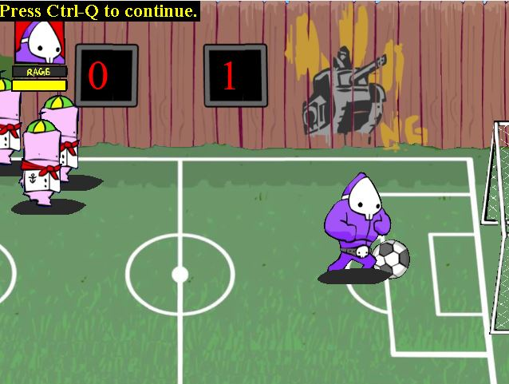

# Dad-n-me-Clone

## 專案說明

### 專案動機

在最一開始選定這個遊戲的時候，想要以小時候玩過且特別有印象的遊戲，
後來就想到紫色恐怖這個遊戲，這個遊戲在小時候的遊戲天堂中特別火紅，因為
其中的操作很簡單，而且目標單一，就是不斷地打敗關卡上的敵人，可以盡情地
毆打敵人藉此抒發壓力，而且以 2D 作呈現。

### 專案架設

使用北科大陳偉凱教授製作的C++GameFramework來開發，自行蒐集網路上的素材來模擬紫色恐怖Dad’n me這款經典遊戲

### 環境安裝

- 由於避免學弟妹clone專案來使用，故不開放原始碼

### 操作方式

- 遊戲玩法
    - 遊戲中的主角可以使用各種技能或地圖上的物件來擊倒
    路上的敵人，目標是擊敗所有Boss以及小怪才算通關
- 基本操作
    - A 為輕拳、S 為重拳
    - A + S 為刺殺刀、A + S + A 為剃頭攻擊
    - 上下左右鍵移動腳色，連續左鍵或右鍵可以進入衝刺狀態
    - 靠近特定物品如瓦斯桶時可以攻擊鍵撿起並再次攻擊鍵丟出投擲物
- 遊戲畫面
    - demo影片
        https://youtu.be/TfXLewJdskE    
    - 開始畫面
        
        
        
    - 中途關卡
        
        
        
    - 小Boss
        
        
        
    - 踢足球小遊戲
        
        
        
    - Boss對戰
        
        
        
    - 角色死亡
        
        
        
    - 重新開始介面
        
        
